# Book Recommendation System

Apache Spark
Python
License

> A scalable hybrid book recommendation system built on Apache Spark, combining Alternating Least Squares (ALS) collaborative filtering with latent-factor re-ranking to deliver personalized top-K recommendations from the Book-Crossing implicit feedback dataset.

---

## Abstract

Recommender systems face two persistent challenges in the book domain: extreme rating sparsity and implicit user feedback. This project implements a hybrid recommendation pipeline on the Book-Crossing dataset (Ziegler et al., 2004), which contains over 1.1 million ratings from 278,858 users across 271,360 books. Explicit integer ratings (0–10) are binarized into implicit feedback (0/1) and fed into Spark MLlib's ALS model with implicit preference mode enabled. Missing user ages are imputed via a Gradient Boosting Tree (GBT) regressor before matrix factorization. Hyperparameters are selected through 3-fold cross-validation over a 81-point grid. The best ALS model (rank=15, λ=0.05, maxIter=15, α=50) achieves a cross-validation RMSE of 4.558 on implicit confidence scores. Re-ranking is performed by computing cosine similarity between ALS latent item factors of the context book and the ALS-recommended candidates, then blending ALS ratings and similarity via a weighted sum (60% ALS, 40% cosine). Ranking evaluation on the held-out test set yields Precision@10 = 0.0026, Recall@10 = 0.0080, and NDCG@10 = 0.0059 — low values that are consistent with the extreme sparsity and binary-label formulation typical of large-scale implicit feedback benchmarks.

---

## Table of Contents

1. [Introduction](#1-introduction)
2. [Related Work](#2-related-work)
3. [Dataset](#3-dataset)
4. [Methodology](#4-methodology)
5. [Experimental Setup](#5-experimental-setup)
6. [Results and Discussion](#6-results-and-discussion)
7. [Reproducibility](#7-reproducibility)
8. [Project Structure](#8-project-structure)
9. [Limitations and Future Work](#9-limitations-and-future-work)
10. [References](#references)
11. [License](#license)

---

## 1. Introduction

Online book platforms expose users to catalogues with hundreds of thousands of titles, making manual discovery impractical. Recommendation systems address this by learning user preferences from historical interaction data. The Book-Crossing dataset presents several real-world challenges that make it a useful benchmark:

- **Extreme sparsity.** The raw user–item matrix has fewer than 0.015% observed entries.
- **Implicit vs. explicit signals.** Explicit ratings (1–10) are noisy proxies; many high-engagement users gave zero (implicit) ratings. We convert ratings to binary implicit feedback.
- **Missing demographic data.** Over 40% of users have no recorded age, requiring imputation before demographic-aware features can be used.
- **Popularity skew.** The long-tail distribution means most books receive very few ratings, reducing signal for collaborative filtering.

**Goal.** Given a user and a currently viewed book, generate a ranked list of top-K personalized book recommendations. The system must scale to millions of ratings using distributed computing (Apache Spark), and improve list quality via a latent-factor re-ranking step.

---

## 2. Related Work

### 2.1 Recommendation System Taxonomy

The field broadly divides into non-personalized (popularity-based) and personalized approaches. Within personalized systems, three main paradigms exist: **Content-Based Filtering**, **Collaborative Filtering (CF)**, and **Hybrid Approaches** that combine signals from both. This project falls in the hybrid category, using model-based CF (ALS matrix factorization) as the primary ranker and latent item factors for re-ranking.

Figure 1 — Recommendation system taxonomy

*Figure 1. Taxonomy of recommendation systems. This project occupies the **Personalized → Hybrid** branch, using model-based CF (ALS / Latent Factor) as the core and adding an item-factor similarity layer.*

### 2.2 Classical Collaborative Filtering and Matrix Factorization

User–user and item–item memory-based CF were among the first practical recommenders but suffer from scalability and cold-start limitations. Matrix Factorization (MF), popularized by the Netflix Prize, decomposes the rating matrix into low-dimensional latent factors and outperforms neighborhood methods, especially with implicit feedback (Hu et al., 2008). Spark MLlib implements MF via ALS with an implicit mode (`implicitPrefs=True`) that treats observed interactions as confidence weights rather than ground-truth ratings.

Figure 2 — Classical recommendation algorithm lineage

*Figure 2. Evolution of classical recommendation algorithms from memory-based CF through Matrix Factorization. ALS (highlighted in the Latent Factor branch) is the technique used in this project.*

### 2.3 Hybrid Recommenders

Burke (2002) formalizes hybrid strategies including weighted, switching, and feature-augmentation hybrids. This project uses a **weighted hybrid**: ALS produces an initial ranked list, then a second score derived from cosine similarity between ALS item latent factors is blended with the ALS rating to produce the final ranking. Because both signals originate from the same learned latent space, this is a latent-factor re-ranking scheme rather than a traditional content-based or knowledge-based hybrid.

This work does not implement deep learning-based recommenders (Neural CF, DeepFM, BERT4Rec, etc.). See Section 9 for a discussion of such approaches as future work.

---

## 3. Dataset

The **Book-Crossing Dataset** was published by Ziegler et al. (2004) and collected from the Book-Crossing community website. It consists of three CSV files joined on `User-ID` and `ISBN`.


| File               | Records   | Key Columns                                                             |
| ------------------ | --------- | ----------------------------------------------------------------------- |
| `Ratings.csv`      | 1,149,780 | `User-ID`, `ISBN`, `Book-Rating` (0–10)                                 |
| `Users.csv`        | 278,858   | `User-ID`, `Location`, `Age`                                            |
| `Books` (embedded) | 271,360   | `ISBN`, `Book-Title`, `Book-Author`, `Year-Of-Publication`, `Publisher` |


### Implicit Feedback Conversion

Explicit ratings are converted to binary implicit signals following the scheme developed in the notebook:


| Raw `Book-Rating`    | Implicit label   | Interpretation               |
| -------------------- | ---------------- | ---------------------------- |
| 0 (implicit/unrated) | unobserved       | Not used as negative example |
| 1 – 5                | **0** (negative) | Below-average engagement     |
| 6 – 10               | **1** (positive) | Above-average engagement     |


### Preprocessing Steps

1. **Age filtering** — users with `Age` outside [10, 80] are removed; remaining nulls are imputed via GBT (see Section 4.1).
2. **Null removal** — rows with missing `ISBN`, `Book-Title`, or `Book-Author` are dropped.
3. **Popularity filter** — books with fewer than **10** ratings are excluded to reduce noise.
4. After filtering, the training set contains 412,362 user–book interactions.

---

## 4. Methodology

### System Pipeline

```mermaid
flowchart LR
  raw["BookCrossing CSVs"] --> clean["Clean and join"]
  clean --> age["GBT age imputation"]
  age --> impl["Implicit 0/1 binarization"]
  impl --> split["80/20 train/test split"]
  split --> cv["ALS 3-fold CV"]
  cv --> best["Best ALS model"]
  best --> recs["ALS top-K candidates"]
  recs --> rerank["Cosine on item latent factors"]
  rerank --> out["Hybrid top-K output"]
```




### 4.1 Preprocessing

Missing ages (approx. 40% of users) are predicted using a Spark ML **Gradient Boosting Tree** regressor. Features include mean publication year, target-encoded author average age, target-encoded publisher average age, and mean book-rating per user. Training RMSE on observed ages ≈ 10.66; this figure reflects imputation quality, not recommendation accuracy.

### 4.2 ALS Collaborative Filtering

Matrix factorization via ALS decomposes the user–item confidence matrix **C** into user factors **P** and item factors **Q**:

$$\hat{r}_{ui} = \mathbf{p}_u^\top \mathbf{q}_i$$

where the implicit-feedback ALS objective (Hu et al., 2008) minimizes:

$$\sum_{u,i} c_{ui}(p_{ui} - \mathbf{p}_u^\top \mathbf{q}_i)^2 + \lambda(\mathbf{p}_u^2 + \mathbf{q}_i^2)$$

with confidence $c_{ui} = 1 + \alpha \cdot r_{ui}$ and preference $p_{ui} \in 0,1$.

Key settings: `implicitPrefs=True`, `nonnegative=True`, `coldStartStrategy="drop"`.

### 4.3 Latent-Factor Re-Ranking (Hybrid Score)

After the ALS model generates an initial top-K candidate list for a user, each candidate book's latent vector $\mathbf{q}_j$ is compared to the context book's latent vector $\mathbf{q}_c$ using cosine similarity:

$$\text{sim}(c, j) = \frac{\mathbf{q}_c^\top \mathbf{q}_j}{\mathbf{q}_c\mathbf{q}_j}$$

The final ranking score blends the ALS confidence prediction with this similarity:

$$\text{FinalScore}(u, j) = 0.6 \cdot \hat{r}_{uj}^{\text{ALS}} + 0.4 \cdot \text{sim}(c, j)$$

Because $\mathbf{q}$ vectors come from the ALS latent space (not hand-crafted metadata), this is a **latent-factor re-ranking** strategy, not a content-based filter.

---

## 5. Experimental Setup

### Data Splits


| Partition | Size     | Notes                                                             |
| --------- | -------- | ----------------------------------------------------------------- |
| Training  | 412,362  | 80% of filtered interactions; `randomSplit(seed=42)`              |
| Test      | ~103,000 | 20% held-out                                                      |
| CV sample | 82,976   | 20% subsample of training used for cross-validation (for runtime) |


### Hyperparameter Grid (3-fold CV, RMSE objective)


| Parameter                  | Values searched | Best     |
| -------------------------- | --------------- | -------- |
| `rank` (latent factors)    | 15, 20, 25      | **15**   |
| `regParam` (λ)             | 0.05, 0.1, 0.15 | **0.05** |
| `maxIter`                  | 15, 20, 25      | **15**   |
| `alpha` (confidence scale) | 10, 45, 50      | **50**   |


Total grid combinations: 81. Best cross-validation RMSE: **4.558**.

### Evaluation Metrics

Ranking quality is measured at cutoff K = 10. A test interaction is considered **relevant** if the implicit label ≥ 0.5 (i.e., positive class).


| Metric      | Formula                                             |
| ----------- | --------------------------------------------------- |
| Precision@K | |{relevant ∩ recommended@K}| / K                    |
| Recall@K    | |{relevant ∩ recommended@K}| / |relevant|           |
| NDCG@K      | DCG@K / IDCG@K (graded relevance with log discount) |
| MAP@K       | Mean Average Precision across users                 |


---

## 6. Results and Discussion

### 6.1 Quantitative Results


| Metric                   | Value  | Evaluation Set    |
| ------------------------ | ------ | ----------------- |
| CV RMSE (ALS confidence) | 4.558  | CV sample (train) |
| Precision@10             | 0.0026 | Test              |
| Recall@10                | 0.0080 | Test              |
| NDCG@10                  | 0.0059 | Test              |
| MAP@10                   | 0.0330 | Train             |
| NDCG@10 (MAP helper)     | 0.0580 | Train             |


### 6.2 Discussion

The low Precision and Recall on the test set are expected given:

- **Extreme sparsity** — the average user has fewer than five positive interactions, so any list of 10 recommendations is unlikely to intersect the tiny ground-truth set.
- **Binary implicit labels** — many books in the "negative" group may have been enjoyed but not rated above 5; the label is noisy.
- **Popularity filter** — removing books with <10 ratings reduces candidate diversity, which tends to drive recommendations toward popular titles.
- **CV on a subsample** — hyperparameter selection used only 20% of the training data; optimal parameters on the full corpus may differ.

The CV RMSE (4.558) measures prediction error on ALS confidence values, not ranking quality, and should not be interpreted as a standard accuracy metric.

### 6.3 Qualitative Example

The hybrid re-ranking output is stored in `[reranked_recommendations.csv](reranked_recommendations.csv)`. A representative sample:


| Book Title                | Author        | ALS Rating | Similarity | Final Score |
| ------------------------- | ------------- | ---------- | ---------- | ----------- |
| The Lovely Bones: A Novel | Alice Sebold  | 1.205      | 0.644      | 0.981       |
| White Oleander: A Novel   | Janet Fitch   | 1.030      | 0.945      | 0.996       |
| The Catcher in the Rye    | J.D. Salinger | 1.013      | 0.360      | 0.752       |
| Summer Sisters            | Judy Blume    | 1.084      | 0.384      | 0.804       |
| Empire Falls              | Richard Russo | 0.963      | 0.444      | 0.755       |


The re-ranking step allows books with moderate ALS scores but high latent-space proximity to the context book to rise in the list, adding a form of contextual coherence.

---

## 7. Reproducibility

### Requirements

```
pyspark==3.5.0
findspark==2.0.1
pandas==2.1.4
numpy==1.26.2
implicit==0.7.2
```

### Installation

```bash
git clone https://github.com/giahuy1310/bookrecommendation.git
cd bookrecommendation
pip install -r requirements.txt
```

### Postgres (Docker) + DBeaver

Local catalog and ratings live in PostgreSQL 16 via Docker Compose:

```bash
docker compose up -d
cp .env.example .env   # sets DATABASE_URL
cd backend && pip install -r requirements.txt
python -m app.db.seed          # full Users/Books/Ratings load; skip if already seeded
python -m app.db.seed --force  # truncate and reload
```

**DBeaver connection:** host `localhost`, port `5432`, database `bookrecommendation`, username `bookrec`, password `bookrec` (same as `docker-compose.yml` / `.env.example`).

If another Postgres already listens on `localhost:5432`, stop it or change the Compose host port mapping so DBeaver/`DATABASE_URL` reach the `bookrecommendation-db` container.

The dataset files (`Ratings.csv`, `Users.csv`, and book metadata in `data.zip`) are committed to the repository. The notebook also downloads them automatically if missing:

```python
# Auto-download inside BigData_off1.ipynb (cell 1)
!wget -O data.zip 'https://github.com/giahuy1310/bookrecommendation/raw/main/BookDataset.zip'
```

### Running the Notebook

```bash
jupyter notebook BigData_off1.ipynb
```

Run all cells sequentially. The notebook will:

1. Install dependencies and initialize Spark.
2. Load and preprocess the dataset.
3. Impute missing ages via GBT.
4. Train ALS with 3-fold cross-validation.
5. Generate and evaluate recommendations.
6. Export results to `reranked_recommendations.csv`.

### Getting Recommendations Programmatically

```python
recommendations = get_reranked_recommendations(
    user_id=12345,
    current_book_isbn='0316666343',  # ISBN of the context book
    num_recommendations=10
)
```

**Returns:** A Spark DataFrame with columns `ISBN`, `Book-Title`, `Book-Author`, `ALS_Rating`, `Similarity`, `Final_Score`.

#### Key Functions


| Function                                                                        | Purpose                                                 |
| ------------------------------------------------------------------------------- | ------------------------------------------------------- |
| `get_reranked_recommendations(user_id, current_book_isbn, num_recommendations)` | Generate hybrid top-K for one user given a context book |
| `calculate_precision_recall_ndcg(model, test_data, k, rating_threshold)`        | Compute Precision@K, Recall@K, NDCG@K on a test split   |
| `calculate_map_ndcg(model, test_data, k)`                                       | Compute MAP@K and NDCG@K                                |


---

## 8. Project Structure

```
bookrecommendation/
├── BigData_off1.ipynb           # Main notebook (preprocessing → training → evaluation)
├── requirements.txt             # Python dependencies
├── LICENSE                      # Apache 2.0 License
├── Ratings.csv                  # User–book ratings (1.1M rows)
├── Users.csv                    # User demographics (278K rows)
├── data.zip                     # Full dataset archive
├── reranked_recommendations.csv # Sample hybrid recommendation output
├── reranked_recommendations.pkl # Serialized recommendations (Pandas DataFrame)
├── recsys_taxonomy2.png         # Figure 1: recommendation system taxonomy
├── classicRec.png               # Figure 2: classical CF / MF lineage
└── DeepRec.png                  # Figure 3: deep learning recommender taxonomy (future work reference)
```

---

## 9. Limitations and Future Work

### Current Limitations


| Limitation                    | Detail                                                                                                                                 |
| ----------------------------- | -------------------------------------------------------------------------------------------------------------------------------------- |
| CV on subsample               | 3-fold CV was run on 20% of training data (82,976 rows) to limit runtime; best hyperparameters may not generalize to the full corpus.  |
| RMSE for implicit ALS         | RMSE measures confidence prediction error, not ranking quality; a ranking evaluator (e.g., NDCG-based CV) would be more appropriate.   |
| Latent-factor similarity only | Re-ranking uses ALS item vectors, not book metadata (title, author, genre). True content-based signals could improve cold-start items. |
| No cold-start evaluation      | Items with fewer than 10 ratings are dropped, so cold-start performance is not measured.                                               |
| Single hybrid weighting       | The 60/40 split is fixed; learning optimal weights per user or query is not explored.                                                  |


### Future Work

Several deep learning architectures (summarized in Figure 3 below) have demonstrated superior ranking performance on implicit feedback datasets:

Figure 3 — Deep learning recommendation algorithm taxonomy

*Figure 3. Taxonomy of deep learning recommenders (He et al., 2017; Cheng et al., 2016). Directions of interest for this project include Neural CF (replace dot product with MLP), DeepFM (combine FM with deep networks), and BERT4Rec (sequence-aware transformer).*

Specific extensions to this system:

- Implement **Neural Collaborative Filtering** (He et al., 2017) using PyTorch or TensorFlow and compare ranking metrics with the ALS baseline.
- Replace fixed hybrid weights with a **learning-to-rank** layer trained to optimize NDCG directly.
- Serve recommendations via a **REST API** (FastAPI or Flask) to enable real-time querying.
- Add **A/B testing** infrastructure to evaluate online recommendation quality.
- Incorporate **textual reviews** (sentiment) as an additional side-feature channel.

---

## References

1. Ziegler, C.-N., McNee, S. M., Konstan, J. A., & Lausen, G. (2004). Improving recommendation lists through topic diversification. *Proceedings of the 14th International Conference on World Wide Web (WWW '04)*, 22–32. [https://doi.org/10.1145/988672.988680](https://doi.org/10.1145/988672.988680)
2. Hu, Y., Koren, Y., & Volinsky, C. (2008). Collaborative filtering for implicit feedback datasets. *Proceedings of the 8th IEEE International Conference on Data Mining (ICDM '08)*, 263–272. [https://doi.org/10.1109/ICDM.2008.22](https://doi.org/10.1109/ICDM.2008.22)
3. Koren, Y., Bell, R., & Volinsky, C. (2009). Matrix factorization techniques for recommender systems. *IEEE Computer*, 42(8), 30–37. [https://doi.org/10.1109/MC.2009.263](https://doi.org/10.1109/MC.2009.263)
4. Burke, R. (2002). Hybrid recommender systems: Survey and experiments. *User Modeling and User-Adapted Interaction (UMUAI)*, 12(4), 331–370. [https://doi.org/10.1023/A:1021240730564](https://doi.org/10.1023/A:1021240730564)
5. He, X., Liao, L., Zhang, H., Nie, L., Hu, X., & Chua, T.-S. (2017). Neural collaborative filtering. *Proceedings of the 26th International Conference on World Wide Web (WWW '17)*, 173–182. [https://doi.org/10.1145/3038912.3052569](https://doi.org/10.1145/3038912.3052569)
6. Apache Software Foundation. (2024). *MLlib: Machine learning library — Collaborative filtering (ALS)*. [https://spark.apache.org/docs/latest/ml-collaborative-filtering.html](https://spark.apache.org/docs/latest/ml-collaborative-filtering.html)

---

## License

This project is licensed under the **Apache License 2.0**. See [LICENSE](LICENSE) for details.

---

*This is a course project demonstrating large-scale data processing and recommendation system techniques using Apache Spark.*